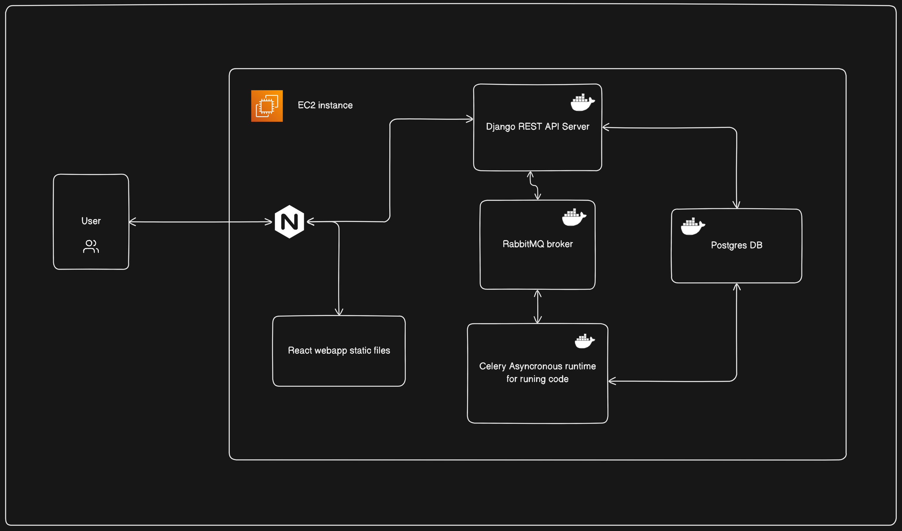

# Algouniversity IDE Assignment

### Deployment link : http://ec2-16-171-6-30.eu-north-1.compute.amazonaws.com
## Run with docker-compose
```
docker compose up -d
```
Access webapp at http://localhost:3000


## Refer this for running without docker
## Requirements
- PostgresSql
- RabbitMQ Broker
  
## Setup

Create virtual environment and source it

```
python3 -m venv ~/django-venv
source ~/django-venv/bin/activate
```
Install Backend Requirements

```
cd backend
pip install -r requirements.txt
```
Add Env Variables (Postgres and RabbitMQ)

```
cd backend
mv .env.example .env
```

Install Frontend Requirements

```
cd frontend
npm install
```

## Run

Run celery task server 

```
cd backend
celery -A backend worker --loglevel=info
```

Start backend server at port 5000

```
cd backend
python manage.py makemigrations
python manage.py migrate
python populate.py
python manage.py runsever 0.0.0.0:5000
```

Start frontend server at port 3000

```
cd frontend
npm run dev
```

## Example code for problem no. 1 
Python 

``` python
class solution:
    def code(inputs):
        if inputs < 0:
            return False

        reversed_num = 0
        temp = inputs

        while temp != 0:
            digit = temp % 10
            reversed_num = reversed_num * 10 + digit
            temp //= 10

        return reversed_num ==inputs

```
JavaScript
```js
function solution(input) {
    let str= input.toString()
    const cleanedStr =str.toLowerCase().replace(/[\W_]/g, '');
    return cleanedStr === cleanedStr.split('').reverse().join('');
}
```

## System Design


## Database Design

