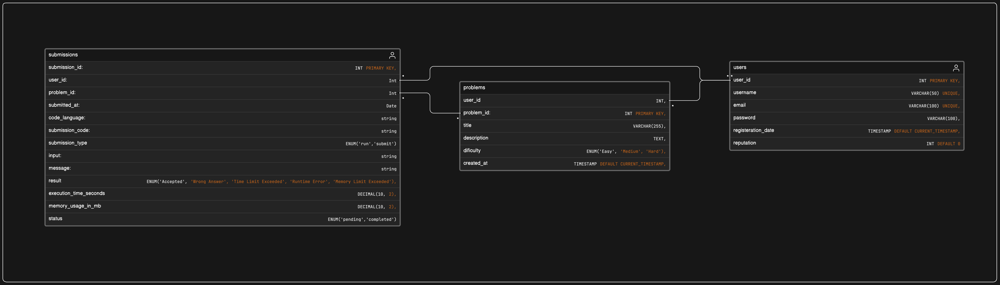

# Algouniversity IDE Assignment

## Run backend with docker-compose
```
docker compose up -d
```
## Run frontend
```
yarn install
yarn dev
```


## Refer this for running without docker
## Setup

Create virtual environment and source it

```
python3 -m venv ~/django-venv
source ~/django-venv/bin/activate
```
Install Backend Requirements

```
cd backend
pip install -r requirements.txt
```

Install Frontend Requirements

```
cd frontend
yarn install or npm install
```

## Run

Start backend server at port 5000

```
cd backend
python manage.py makemigrations
python manage.py migrate
python manage.py runsever 0.0.0.0:5000

```

Start frontend server at port 5173

```
cd frontend
yarn dev
```

## System Design


## Database Design

